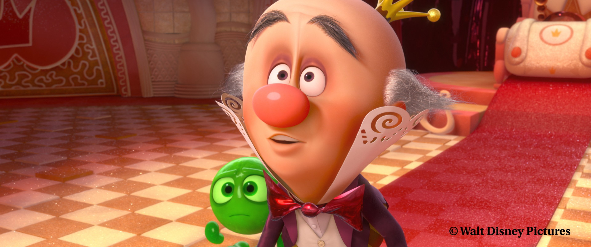

## 6 Опыт производства Wreck-It Ralph

Мы развернули наш шейдер «Principled Layers» в Wreck-It Ralph и использовали его практически для каждого материала, за исключением волос (которые по-прежнему используют модель, разработанную для Tangled). Разнообразие материалов можно увидеть на рисунке 21. Обратите внимание, что для зеркальных компонентов часто использовалась отдельная нормаль, чтобы создать эффект блеска, который здесь виден на земле, ковре и других гранулированных материалах.

Рисунок 21: Кадр производства Wreck-It Ralph.

В сочетании с нашей новой моделью материала мы также представили новые источники света на основе выборки области и изображения, которые имеют решающее значение для того, чтобы правдоподобные материалы выглядели хорошо; если вы создадите правдоподобный блестящий материал и осветите его точечным источником света, ваш блик будет маленькой точкой, но разрешение осветителям регулировать свойства материала, например, увеличивать шероховатость для имитации реакции на свет области, разрушает всю физически обоснованную парадигму затенения. Хорошей новостью является то, что осветителям действительно нравятся зональные светильники и IBL за их управляемость, а также они ценят наличие последовательного материального отклика. Также стоит отметить, что новая модель материала была как мотиватором, так и средством реализации перехода на сэмплированные светильники, поскольку с нашей предыдущей моделью затенения ad-hoc было бы слишком дорого для каждого модуля отражения выполнять собственную интеграцию сэмплированного света.

Основываясь на успехе в Wreck-It Ralph, наши следующие шоу уже используют или планируют использовать нашу новую модель затенения без изменений.

### 6.1 Разработка внешнего вида

Одним из преимуществ наличия единого BRDF для всего является то, что он упрощает разработку нашего интерактивного редактора материалов. Наш «Material Designer» визуализирует буфер геометрии (или «g-буфер»), содержащий нормали, идентификаторы объектов и маски слоев материалов. Используя эти каналы, он быстро выполняет повторное освещение на основе изображения, позволяя интерактивно редактировать все параметры BRDF. Художники могут вращать IBL в реальном времени и видеть полный эффект всех параметров и слоев в полном контексте на производственных моделях.

Еще одним преимуществом унифицированной модели является то, что она предоставляет очень простую библиотеку материалов, состоящую из набора предустановок, сохраненных из Material Designer. Материал можно выбрать из библиотеки и добавить в шейдер в качестве дополнительного слоя, а затем смешать с маской. Таким образом, слои можно быстро выстраивать, как стек слоев Photoshop.

Чтобы полностью оценить материал, важно осветить его со всех сторон. В рамках перехода на нашу новую модель материалов мы начали проверять все элементы с помощью различных IBL, и все поворотные столы включают как вращение элементов, так и освещение.

Конечным результатом нашей новой системы шейдеров стало значительное повышение производительности при разработке внешнего вида, гораздо более короткое время обучения для новых художников и более стабильно высокое качество результатов. Примечательно, что большинство наших художников по разработке внешнего вида смогли уйти с шоу раньше из-за отсутствия необходимости в «переделывании» материалов в освещении. Это было беспрецедентно.

### 6.2 Освещение

Как упоминалось ранее, для работы с новой моделью материалов требовался другой подход к освещению. Это потребовало большой кривой обучения. Также было сложно добавить обратно художественные элементы управления освещением без чрезмерного ущерба для физически обоснованной модели.

Одним из самых больших изменений в освещении стал переход к использованию IBL в качестве локального заполняющего света. Большинство IBL используются со светом, привязанным к определенным элементам в кадре, и многие имеют отсечки по расстоянию. Это было большим улучшением по сравнению с предыдущими картами окружения, которые в значительной степени игнорировали характеристики материалов. Освещение площадок также было хорошо принято как дополнение.

Одной из самых больших проблем для осветителей изначально была работа с реалистичными значениями интенсивности света и спадом. В конечном итоге мы разработали нефизический контроль спада, который работает, делая источник света виртуально более удаленным, автоматически регулируя интенсивность для достижения желаемой экспозиции на заданном расстоянии, однако управление интенсивностью света и спадом остается проблемой для осветителей.

Еще одной проблемой для освещения является тот факт, что зеркальные блики теперь требуют своего рода тональной компрессии. Блики на блестящих материалах могут достигать сотен, и простое обрезание значений выглядит резким, вводит полосы, поскольку каждый цветовой канал обрезается в другом месте, и заставляет ядро ​​всегда переходить к белому. Мы разработали новый глобальный оператор тональной компрессии, который сохраняет цветовые значения для большей части диапазона отображения и спадает с верхнего предела, сохраняя цвет и контрастность. У нас есть настройка по умолчанию, которая работает разумно в большинстве случаев, но корректирует окончательные значения для каждого снимка во время цветокоррекции.

Однако в конечном итоге материалы ведут себя предсказуемо, что является огромным преимуществом для осветителей и дает им отправную точку, которая является физически правдоподобной.

### 6.3 Будущая работа

Одной из самых больших проблем в настоящее время является отсутствие интуитивно управляемой модели подповерхности. Ключевым аспектом этого является интеграция BRDF. В идеале должно быть соответствие между BRDF и моделью подповерхности, чтобы модель BRDF можно было использовать для удаленных объектов, достигая эквивалентных результатов. Кроме того, художник должен иметь возможность увеличить средний свободный путь от нуля, чтобы добавить эффект подповерхности к объекту, не меняя общую экспозицию — должна измениться только форма диффузии (и свет должен просачиваться в тени, если включена диффузия).
Мы хотели бы пойти дальше с моделированием отражательной способности ткани. Мы знаем, что можем добавить специальный шейдер для рендеринга ткани с использованием полученных данных об отражательной способности для особенно сложных моделей ткани, но мы хотели бы исследовать прямое моделирование более широкого спектра материалов ткани. Однако в настоящее время у нас нет шоу, которое бы стимулировало эту потребность.

Мы также получили запросы на добавление иридизации к нашей модели. Это должно быть так же просто, как добавление зеркальной вариации цвета, как обсуждалось ранее.