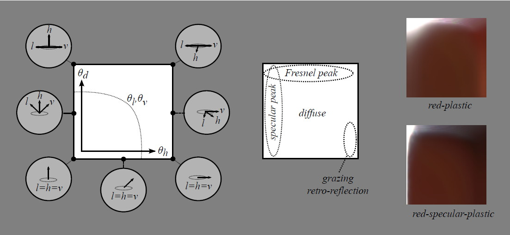

## 3 Визуализация измеренных BRDF-ов

### 3.1 «MERL 100»

Рисунок 1: Срезы изображений MERL 100 BRDFs.  

Набор из 100 изотропных образцов материалов BRDF был получен Матусиком и др. в 2003 году [^18], охватывающий широкий спектр материалов, включая краски, древесину, металлы, ткани, камень, резину, пластик и другие синтетические материалы. Этот набор данных находится в свободном доступе в Mitsubishi Electric Research Laboratories по адресу [www.merl.com/brdf](www.merl.com/brdf) и обычно используется для оценки новых моделей BRDF. Срезы этих BRDF показаны на рисунке 1.

[^18]: Войцех Матусик, Ханспетер Пфистер, Мэтт Брэнд и Леонард Макмиллан. Модель отражения, управляемая данными. *ACM Transactions on Graphics*, 22(3):759–769, июль 2003 г. / Wojciech Matusik, Hanspeter Pfister, Matt Brand, and Leonard McMillan. A data-driven reflectance model. *ACM Transactions on Graphics*, 22(3):759–769, July 2003.

Каждый BRDF в MERL 100 плотно отобран в куб 90 на 90 на 180 вдоль осей $θ_h$, $θ_d$ и $\phi_d$ соответственно. Они соответствуют приращениям в 1 градус, за исключением оси $θ_h$, которая была деформирована для концентрации образцов данных вблизи зеркального пика. Измерения были отфильтрованы и экстраполированы по мере необходимости, чтобы в данных не было пробелов. Это хорошо тем, что данные легко использовать, но неясно, насколько точны данные, особенно вблизи горизонта. Из-за этого некоторые исследователи отбрасывают данные вблизи горизонта при выполнении подгонки, но эти данные все равно полезно учитывать, поскольку они могут оказать сильное влияние на внешний вид материала.

### 3.2 BRDF проводник

Рисунок 2: Диснеевский BRDF проводник

Для изучения материалов, измеренных MERL, и сравнения с аналитическими моделями мы разработали новый инструмент, BRDF Explorer, показанный на рисунке 2. Он доступен как открытый исходный код на [www.github.com/wdas/brdf](www.github.com/wdas/brdf) и имеет следующие функции:

-   Возможность загрузки нескольких аналитических BRDF, написанных на GLSL
-   Возможность загрузки измеренных BRDF, включая образцы анизотропных материалов, полученные Нганом и др. [^21]
-   Множественные графики данных (3D-полусферический вид, полярный график и различные декартовы графики)
-   Вычисленный график альбедо (т. е. направленно-полусферическое отражение)
-   Просмотр среза изображения с элементами управления экспозицией
-   Просмотр освещенного объекта с выборкой важности IBL
-   Просмотр освещенной сферы
-   Динамические элементы управления пользовательского интерфейса для параметрических моделей

[^21]: Эдди Нган, Фредо Дюран и Войцех Матусик. Экспериментальный анализ моделей BRDF. В работе Кавиты Балы и Филиппа Дютре, редакторов, *Eurographics Symposium on Rendering*, страницы 117–126, Констанц, Германия, 2005. Ассоциация Eurographics. / Addy Ngan, Frédo Durand, and Wojciech Matusik. Experimental analysis of BRDF models. In Kavita Bala and Philip Dutré, editors, *Eurographics Symposium on Rendering*, pages 117–126, Konstanz, Germany, 2005. Eurographics Association.

Этот инструмент оказался бесценным при сравнении измеренных материалов с существующими аналитическими моделями, а также при разработке нашей новой модели. Удивительно, но он также оказался очень полезным для художников как интерактивный редактор BRDF, предоставляя им более глубокое понимание параметров модели и пространства BRDF.

### 3.3 Срез изображения

Рисунок 3: Срезы изображений BRDF для *красного-пластика* и *зеркального-красного-пластика*, показанные вместе со схематическим видом «пространства среза».

Один из самых простых и интуитивно понятных способов визуализации измеренного материала — просто просмотреть его как стопку изображений, и мы обнаружили, что это очень мощный инструмент для получения интуитивного представления о данных. Как оказалось, все интересные особенности в материалах MERL 100 видны в срезе $\phi_d = 90$. Схематический вид этого пространства вместе с двумя образцами материалов показан на рисунке 3. Другие срезы — это просто деформированные версии этого среза, как показано на рисунке 4. Это наблюдение было использовано в недавних работах, таких как Ромейро (2008) [^26] и Пакановски (2012) [^24], в качестве основы для упрощенных изотропных моделей BRDF формы $f (θ_h, θ_d)$.

[^24]: Ромен Пакановски, Оливер Салазар Селис, Кристоф Шлик, Ксавье Гранье, Пьер Пулен и Энни Кюйт. Рациональная brdf. *Труды IEEE по визуализации и компьютерной графике*, 99 (PrePrints), 2012. / Romain Pacanowski, Oliver Salazar Celis, Christophe Schlick, Xavier Granier, Pierre Poulin, and Annie Cuyt. Rational brdf. *IEEE Transactions on Visualization and Computer Graphics*, 99(PrePrints), 2012.

[^26]: Фабиано Ромейро, Юрий Васильев и Тодд Циклер. Пассивная рефлектометрия. *В трудах 10-й Европейской конференции по компьютерному зрению: Часть IV, ECCV* ’08, страницы 859–872, Берлин, Гейдельберг, 2008. Springer-Verlag. / Fabiano Romeiro, Yuriy Vasilyev, and Todd Zickler. Passive reflectometry. In *Proceedings of the 10th European Conference on Computer Vision: Part IV, ECCV* ’08, pages 859–872, Berlin, Heidelberg, 2008. Springer-Verlag.

Рисунок 4: Срезы *зеркально-красного-пластика* для различных значений $\phi_d$, азимутального вращения $\mathbf{l}$ вокруг половинного вектора. Черная область в правом верхнем углу представляет собой часть области BRDF, где вектор $\mathbf{l}$ или $\mathbf{v}$ находится ниже горизонта.

В срезе изображения левый край представляет собой зеркальный пик, а верхний край представляет собой пик Френеля. Обратите внимание, что вдоль нижнего края векторы света и вида совпадают, поэтому нижний край представляет собой ретрорефлексию. Нижний правый угол, в частности, представляет собой скользящее ретрорефлекторное отражение. Диффузное отражение проявляется во всем пространстве BRDF, но середина изображения, как правило, изолирована от диффузного отклика.

Схематическое изображение на рисунке 3 также включает изолинию $θ_l$ или $θ_v$. Многие диффузные эффекты имеют тенденцию следовать этому контуру. Обратите внимание, что эти изолинии выпрямляются, когда $\phi_d$ приближается к нулю, и сравнение срезов $\phi_d$ может дать представление о том, какие части отклика материала обусловлены диффузным отражением, а какие — зеркальным. Еще одним намеком, конечно, является цвет; диффузное отражение обусловлено подповерхностным рассеянием и поглощением, что приводит к видимому оттенку, тогда как зеркальное отражение исходит от поверхности и не тонируется (если только поверхность не металлическая, в этом случае диффузный компонент отсутствует).