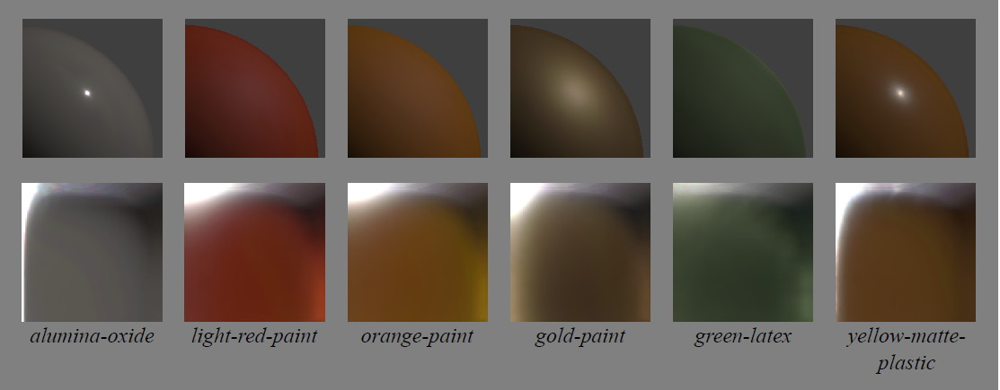
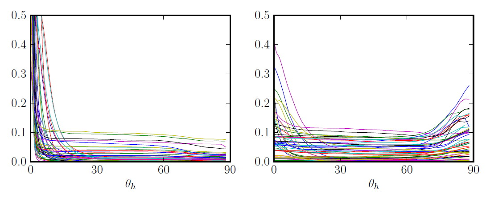

## 4 Наблюдения за материалами MERL

### 4.1 Наблюдения за диффузным отражением

Рисунок 5: Материалы, демонстрирующие диффузное изменение цвета. Верхний ряд: отклики точечного света на визуализированных сферах; нижний ряд: срезы изображений BRDF.

Диффузное отражение представляет собой свет, который преломляется на поверхности, рассеивается, частично поглощается и переизлучается. Учитывая, что часть света поглощается, отклик диффузного отражения будет окрашен цветом поверхности, и любая часть неметаллического материала, которая окрашена, может считаться диффузным.

Рисунок 6: Ретрорефлетивные отражения 100 MERL материалов. Слева: 50 гладких материалов $(f(0) > 0,5)$; справа: 50 шероховатых материалов $(f(0) < 0,5)$. Пик около $θ_h = 0$ является зеркальным пиком, а пик (или спад) около $θ_h = 90$ представляет собой скользящую ретрорефлексию.

Рисунок 7: Реакция точечного света на _красный-пластик_, _зеркальный-красный-пластик_ и диффузный Ламберт.

Модель диффузного Ламберта предполагает, что преломленный свет достаточно рассеялся, чтобы потерять всю направленность, и, таким образом, диффузное отражение постоянно. Однако на различных срезах изображения на рисунках 1 и 5 можно увидеть, что очень немногие материалы демонстрируют ламбертовский отклик. [Примечание: _шейдер_ Ламберта включает фактор $\mathbf{n}\cdot\mathbf{l}$, но это часть интеграла освещения, а не BRDF.]

Как показано на рисунке 6, многие материалы показывают падение скользящего ретроотражения, а многие другие показывают пик. Это, по-видимому, диффузное явление из-за кажущегося окрашивания в срезах изображения. В частности, это сильно коррелирует с шероховатостью — гладкие поверхности, т. е. те, у которых более высокий зеркальный пик, как правило, имеют затененный край, а шероховатые поверхности, как правило, имеют пик вместо тени. Эту корреляцию можно увидеть в кривых световозвращения, а также в визуализированных сферах на рисунке 7.

Скользящая тень для гладких поверхностей предсказывается уравнениями Френеля: при углах скольжения больше энергии отражается от поверхности и меньше преломляется в поверхность для диффузного переизлучения. Однако диффузные модели обычно не учитывают влияние шероховатости поверхности на френелевскую рефракцию и либо предполагают гладкую поверхность, либо игнорируют эффект Френеля.

Модель Орена-Наяра (1995) предсказывает увеличение световозвращения для шероховатых диффузных поверхностей, которое сглаживает диффузную форму. Однако этот пик световозвращения не такой сильный, как измеренные данные, и грубые измеренные материалы обычно не демонстрируют сглаживания диффузной формы. Модель Ханрахана-Крюгера (1993), полученная из теории подповерхностного рассеяния, также предсказывает сглаживание диффузной формы, но не имеет достаточно сильного пика на краю. В отличие от модели Орена-Наяра, эта модель предполагает идеально гладкую поверхность. Модели Орена-Наяра и Ханрахана-Крюгера сравниваются на рисунке 8.

Рисунок 8: Срезы BRDF и отклики на точечный свет диффузных моделей Ламберта(Lambert), Орена-Наяра(Oren-Nayar) и Ханрахара-Крюгера(Hanrahan-Krueger).

Помимо пика ретрорефлективности, в срезах изображения на рисунке 5 можно увидеть дополнительную диффузную вариацию. Можно увидеть как интенсивность, так и цветовую вариацию, которая следует за изолиниями $θ_l / θ_v$. В некоторых случаях это может быть связано со слоистым подповерхностным рассеянием. Однако даже модели слоистого подповерхностного рассеяния обычно считают поверхность гладкой и не создают сильного пика ретрорефлективности.

### 4.2 Наблюдения D зеркальности

Функцию распределения микрограней, $D(θ_h)$, можно наблюдать из ответов ретрорефлективного отражения измеренных материалов, как показано на рисунке 6. Материалы были разделены на две группы в зависимости от высоты пика, который можно рассматривать как показатель шероховатости поверхности. Самый высокий пик, от _стали_, был более 400. После того, как пик выровняется, оставшаяся часть кривой, вероятно, обусловлена ​​диффузным отражением.

Подавляющее большинство материалов MERL имеют зеркальные доли с хвостами, которые намного длиннее, чем традиционные зеркальные модели. Примером является образец _хрома_, показанный на рисунке 9. Зеркальный отклик этого материала типичен для гладких, хорошо отполированных поверхностей, с зеркальным пиком шириной всего в пару градусов и зеркальным хвостом, который во много раз шире. Любопытно, что традиционные распределения Бекманна, Блинн-Фонга и Гаусса почти идентичны при этой ширине и не могут хорошо представлять ни пик, ни хвост.

Рисунок 9: Несколько зеркальных распределений, соответствующих хрому MERL. Слева: логарифмические графики зеркального пика в зависимости от $θ_h$ (градусы); черный = хром, красный = GGX ($α$ = 0,006), зеленый = Бекманн ($m$ = 0,013), синий = Блинн-Фонг ($n$ = 12000). Справа: (обрезанные) точечные световые отклики от хрома, GGX и Бекманна.

Необходимость в более широком хвосте была мотивацией для распределения GGX, представленного Уолтер и др. (2007) [^33]; GGX имеет гораздо более длинный хвост, чем другие распределения, но все еще не может уловить светящийся блик образца хрома. Важность моделирования хвостового отклика для подгонки измеренных материалов также была основой двух недавних моделей, Лёв и др. (2012) [^17] и Багер и др. (2012) [^4]. Обе эти модели добавляют дополнительный параметр для управления хвостом отдельно от пика. Другим вариантом моделирования хвоста является использование второго более широкого зеркального пика, добавленного к первому, как предложил Нган [^21].

[^33]: Брюс Уолтер, Стивен Р. Маршнер, Хонгсонг Ли и Кеннет Э. Торранс. Модели микрограней для преломления через шероховатые поверхности. *В трудах симпозиума Eurographics по рендерингу*, 2007. / Bruce Walter, Stephen R. Marschner, Hongsong Li, and Kenneth E. Torrance. Microfacet models for refraction through rough surfaces. In *Proceedings of the Eurographics Symposium on Rendering*, 2007.

### 4.3 Наблюдения F зеркальности

Рисунок 10: Нормализованные отклики Френеля 100 MERL материалов, построенные в зависимости от $θ_d$. Отклики были усреднены по $θ_h$ от 1 до 4 градусов, отклик падения был вычтен, а кривые затем были нормализованы по $θ_d$ от 45 до 80 градусов для сравнения формы. Пунктирная линия представляет теоретический отклик Френеля.

Коэффициент отражения Френеля, $F (θ_d)$, представляет собой увеличение зеркального отражения по мере того, как векторы света и зрения расходятся, и предсказывает, что все гладкие поверхности будут приближаться к 100% зеркальному отражению при скользящем падении. Для шероховатых поверхностей 100% зеркальное отражение не будет достигнуто, но отражательная способность все равно будет становиться все более зеркальной.

Кривые отклика Френеля для материалов MERL показаны на рисунке 10. Кривые были смещены и масштабированы для сравнения общей формы их отклика. Каждый материал показывает некоторое увеличение отражательной способности вблизи $θ_d = 90$. Это также можно увидеть вдоль верхних краев срезов изображения на рисунке 1.

Примечательно, что крутизна многих кривых вблизи углов скольжения больше, чем предсказывает эффект Френеля. Это наблюдение фактически послужило мотивацией модели микрограней Torrance-Sparrow (1967) [^30] для объяснения «внезеркального пика», наблюдаемого при более высоких углах падения. Обратите внимание, что фактор $\frac1{4\cosθ_l \cos θ_v}$ в модели микрограней стремится к бесконечности при углах скольжения. Причина, по которой это не является проблемой (как в модели, так и в реальном мире), заключается в том, что отражательная способность скольжения уменьшается из-за эффектов затенения микроповерхности. Фактор $G$ представляет затенение вектора света и, симметрично, маскирование вектора вида, и контролирует отражательную способность скольжения. Но даже несмотря на то, что фактор $G$ представляет собой затенение, сочетание $G$ с $\frac1{4\cosθ_l \cos θ_v}$ эффективно усиливает эффект Френеля.

### 4.4 Наблюдения G зеркальности (и альбедо)

Рисунок 11: Графики альбедо материалов MERL 100. Слева: 50 гладких материалов; справа: 50 шероховатых материалов.

Трудно выделить $G$ в измеренных данных, поскольку это требует точной оценки факторов $D$ и $F$, а также изоляции зеркального от диффузного. Однако влияние $G$ можно увидеть косвенно в его влиянии на направленное альбедо.

Альбедо — это отношение полной отраженной энергии к полной падающей энергии. В общих чертах оно представляет цвет поверхности и должно быть меньше 1 для всех длин волн. Альбедо также можно рассматривать для света, идущего с одного направления, например, от солнца, в этом случае альбедо становится направленной функцией, зависящей от угла падения, и должно быть меньше 1 для всех углов и длин волн.

Направленное альбедо большинства материалов относительно плоское для первых 70 градусов, как показано на рисунке 11, а альбедо при скользящих углах сильно коррелирует с шероховатостью поверхности. Гладкие материалы показывают небольшое увеличение около 75 градусов, за которым следует падение к 90. Шероховатые поверхности увеличиваются, часто значительно, вплоть до скользящего падения. Примечательно, что значения альбедо в целом довольно низкие, и лишь немногие материалы имеют альбедо выше 0,3.

Скользящее ретроотражение, демонстрируемое многими грубыми материалами, также вносит значительный вклад в этот прирост, о чем свидетельствует хроматический оттенок в альбедо.

Отклик альбедо, соответствующий выбору смоделированных факторов $G$, показан на рисунке 12 как для очень гладкой, так и для очень шероховатой поверхности. Примечательно, что полное исключение $G$ и $\frac1{\cosθ_l \cos θ_v}$, называемое моделью «Без $G$», приводит к слишком темному отклику при углах скольжения. Важным моментом здесь является то, что выбор функции $G$ оказывает сильное влияние на альбедо, которое, в свою очередь, оказывает сильное влияние на внешний вид поверхности.

Рисунок 12: Графики альбедо, сравнивающие несколько зеркальных моделей $G$. Все графики используют одни и те же факторы $D$ (GGX/TR) и $F$. Слева: гладкая поверхность ($α = 0.02$); справа: шероховатая поверхность ($α = 0.5$). Модель «без $G$» исключает факторы $G$ и $\frac{1}{\cosθ_l \cos θ_v}.$

Несколько зеркальных моделей были разработаны специально с целью создания более правдоподобной кривой отклика альбедо [^30], [^29], [^19], [^20], [^8], [^9], [^33], [^10], [^14]. Для некоторых из них намерение состоит в том, чтобы сделать альбедо идеально плоским для поддержания энергетического баланса. Основываясь на графиках альбедо данных Мерла на рисунке 11, это не необоснованная цель, хотя большинство материалов действительно показывают некоторый прирост скольжения. Даже тогда часть прироста скольжения, вероятно, обусловлена ​​незеркальными эффектами.

С несколькими упрощающими предположениями можно вывести функцию затенения из распределения микрограней, $D$, следуя методу Смита [^29]. Этот подход использовали Уолтер (2007) и Шлик (1994). Как видно на рисунке 12, отражательная способность скольжения модели Смита из Уолтера значительно увеличивается для гладких поверхностей, эффект, который не наблюдается в измеренных данных. Для более грубых значений отклик кажется более правдоподобным. Обратите внимание, что $G$ Смита имеет аналитическую форму только для небольшого числа функций, и часто используется табличное интегрирование или некоторое другое приближение.

Недавняя эмпирическая модель Курта и др. (2010) [^14] использует другой подход и предлагает модель подгонки данных со свободным параметром. Рисунок 12 показывает модель Курта с использованием $α = 0.25$; другие значения $α$ могут давать широкий диапазон откликов альбедо. Однако вызывает беспокойство то, что альбедо Курта расходится вблизи углов скольжения, что значительно для грубых распределений. Другой вариант — просто использовать один из выводов Смита $G$ из Вальтера или даже более простой вывод Шлика и выделить шероховатость $G$ как свободный параметр.

### 4.5 Ткань

Многие образцы тканей в базе данных MERL демонстрируют зеркальный оттенок при углах скольжения, а также имеют пик Френеля, который сильнее, чем у материалов с сопоставимой шероховатостью. Примеры этого показаны на рисунке 13.

Рисунок 13: Срезы изображений BRDF различных образцов тканей.

Окрашенный отклик скольжения можно объяснить тем, что ткань часто имеет пропускающие волокна, которые улавливают цвет материала вблизи силуэтов объектов. Это также может объяснить дополнительный выигрыш для ткани при углах скольжения сверх того, что предсказывает модель микрограней.

В то время как многие ткани могут иметь очень сложную реакцию материала, ткани MERL, по-видимому, относительно легко моделировать.

### 4.6 Радужность 

Рисунок 14: Срезы изображений BRDF _рисунок-цветового-изменения-1, 2_ и _3_. Верхний ряд: исходные данные; нижний ряд: соответствующие изображения цветности, созданные путем масштабирования на $1 / \max(r, g, b)$ на пиксель.

Три краски, меняющие цвет, показанные на рисунке 14, демонстрируют когерентные пятна цвета в пространстве ($θ_h, θ_d$) с минимальной зависимостью от $\phi_d$. Это, по-видимому, полностью зеркальное явление, учитывая, что вдали от зеркального пика очень мало отражения. Это можно смоделировать просто путем модуляции зеркального оттенка как функции $θ_h$ и $θ_d$, возможно, с помощью небольшой текстурной карты.

### 4.7 Аномалии данных

Некоторые аномалии в данных MERL показаны на рисунке 15.

- Некоторые из очень блестящих материалов, особенно металлы, демонстрируют асимметричные блики, указывающие на блики линз или, возможно, анизотропные царапины на поверхности.

- Данные за пределами примерно 75 градусов, по-видимому, экстраполируются.

- Реакция тканей на скольжение часто имеет странные разрывы, возможно, из-за того, что ткани растягиваются по сферам во время захвата и сморщиваются вблизи краев.

- Некоторые виды древесины демонстрируют зеркальные модели модуляции вдоль $θ_d$, которые могут быть вызваны древесными волокнами.

- Эффекты подповерхностного рассеяния запечены.

Рисунок 15: Аномалии в данных MERL. Слева направо: реакция _стали_ на точечный свет демонстрирует асимметричный блик, график _рисунка-цветового-измененеия-1_, показывает экстраполированные данные о скольжении (видимые во всех материалах), _белая-ткань_ демонстрирует затенение вблизи скольжения, указывающее на морщину, а _древесина-фруктов-241_ (показанная как сохраненная, в искривленном пространстве $θ_h$) демонстрирует зеркальные вариации, указывающие на древесные волокна.

Это не критика данных или процесса захвата, а скорее просто предостережение не переобучать или не переинтерпретировать данные. Это также потенциально часть ответа на вопрос, заданный ранее, о том, почему некоторые материалы трудно подгонять.